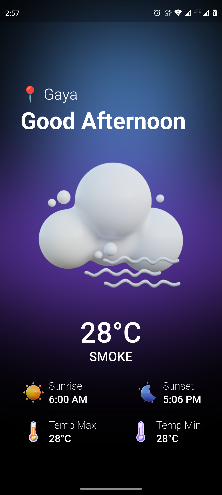

# Weather UI Flutter Project

This is a Flutter project that showcases a beautiful weather user interface (UI) using the BLoC (Business Logic Component) architecture and data from the OpenWeather API. Whether you're a Flutter developer looking to learn more about BLoC or just want to create a stunning weather app, this project provides a great starting point.

## Table of Contents

- [Features](#features)
- [Requirements](#requirements)
- [Getting Started](#getting-started)
- [Configuring the OpenWeather API](#configuring-the-openweather-api)
- [Running the App](#running-the-app)

## Features

- Beautiful and user-friendly weather UI.
- Real-time weather data retrieved from the OpenWeather API.
- BLoC architecture for state management.
- Clean and well-organized project structure.
- City search to view weather for different locations.

## Requirements

To run this project, make sure you have the following software installed on your development machine:

- Flutter: You can find installation instructions [here](https://flutter.dev/docs/get-started/install).
- Dart: Included with the Flutter installation.
- IDE of your choice (e.g., Android Studio, Visual Studio Code).

## Getting Started

1. Clone this repository to your local machine:
```console
git clone https://github.com/carpetbhaiya/WeatherUI.git
```
2. Navigate to the project directory:
```console
cd weather-ui-flutter
```
3. Install the project dependencies:
```console
flutter pub get
```

## Configuring the OpenWeather API

To fetch weather data, you'll need an API key from [OpenWeather](https://openweathermap.org/). Follow these steps to configure the API:

1. Sign up for an OpenWeather account or log in if you already have one.

2. Generate an API key in your OpenWeather account.

3. Copy the API key to your clipboard.

4. Paste it in a file named `my_data.dart` inside the `lib/data` directory and add the following code:

```dart
String API_KEY = "YOUR_OPENWEATHER_API_KEY"
```
Replace **'YOUR_OPENWEATHER_API_KEY'** with your actual API key.

## Running the App

You can run the app on a simulator or a physical device. Use the following commands:

- To run the app in Android Emulator or device:
```bash
flutter run
```

## ScreenShot


